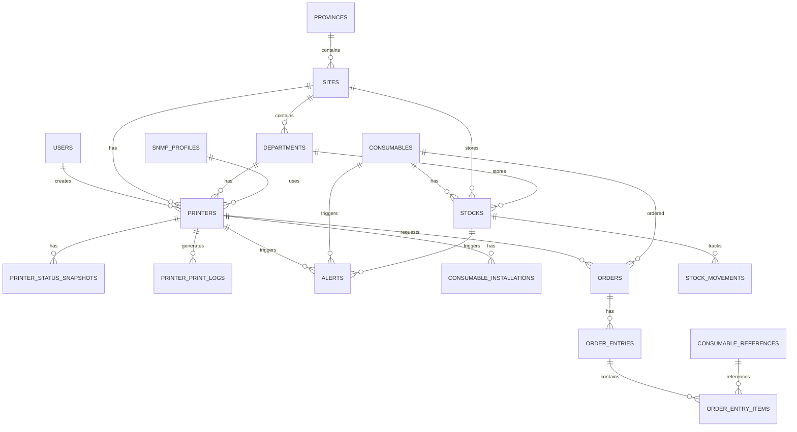

# Documentación de Base de Datos - JNC-AdaPrinters

Documentación completa de la estructura de la base de datos PostgreSQL.

## Tabla de Contenidos

1. [Resumen General](#resumen-general)
2. [Diagrama ER](#diagrama-er)
3. [Tablas Principales](#tablas-principales)
4. [Relaciones](#relaciones)
5. [Índices y Constraints](#índices-y-constraints)
6. [Migraciones](#migraciones)

## Resumen General

La base de datos utiliza **PostgreSQL 16** y sigue las convenciones de Laravel Eloquent. Todas las tablas incluyen timestamps (`created_at`, `updated_at`) y utilizan UUIDs para identificadores únicos cuando es necesario.

### Estadísticas

- **Total de tablas**: 30+
- **Motor**: PostgreSQL 16
- **Encoding**: UTF-8
- **Timezone**: UTC

## Diagrama ER



## Tablas Principales

### users

Tabla de usuarios del sistema.

| Campo | Tipo | Descripción |
|-------|------|-------------|
| id | bigint | PK, autoincremental |
| name | string | Nombre completo |
| email | string(255) | Email único |
| email_verified_at | timestamp | Verificación de email |
| password | string | Hash de contraseña |
| page_permissions | jsonb | Permisos de páginas |
| location_permissions | jsonb | Permisos de ubicaciones |
| read_write_permissions | jsonb | Permisos de lectura/escritura |
| remember_token | string | Token de sesión |
| created_at | timestamp | Fecha de creación |
| updated_at | timestamp | Fecha de actualización |

**Relaciones:**
- `hasMany` Printer (created_by)
- `hasMany` Order (created_by)
- `hasMany` Alert (acknowledged_by)
- `hasMany` Stock (managed_by)

### provinces

Provincias/regiones geográficas.

| Campo | Tipo | Descripción |
|-------|------|-------------|
| id | bigint | PK |
| name | string | Nombre de la provincia |
| code | string | Código único |
| region | string | Región |
| is_active | boolean | Activa |
| metadata | jsonb | Datos adicionales |
| created_at | timestamp | |
| updated_at | timestamp | |

**Relaciones:**
- `hasMany` Site
- `hasMany` Printer

### sites

Sedes/ubicaciones físicas.

| Campo | Tipo | Descripción |
|-------|------|-------------|
| id | bigint | PK |
| province_id | bigint | FK a provinces |
| name | string | Nombre de la sede |
| code | string | Código único |
| address | string | Dirección |
| city | string | Ciudad |
| postal_code | string | Código postal |
| latitude | decimal | Latitud |
| longitude | decimal | Longitud |
| contact_email | string | Email de contacto |
| contact_phone | string | Teléfono |
| is_active | boolean | Activa |
| metadata | jsonb | Datos adicionales |
| created_at | timestamp | |
| updated_at | timestamp | |

**Relaciones:**
- `belongsTo` Province
- `hasMany` Department
- `hasMany` Printer
- `hasMany` Stock

### departments

Departamentos dentro de sedes.

| Campo | Tipo | Descripción |
|-------|------|-------------|
| id | bigint | PK |
| site_id | bigint | FK a sites |
| name | string | Nombre del departamento |
| code | string | Código único |
| floor | string | Planta/piso |
| contact_email | string | Email |
| contact_phone | string | Teléfono |
| is_active | boolean | Activo |
| is_warehouse | boolean | Es almacén |
| metadata | jsonb | Datos adicionales |
| created_at | timestamp | |
| updated_at | timestamp | |

**Relaciones:**
- `belongsTo` Site
- `hasMany` Printer
- `hasMany` Stock

### printers

Impresoras del sistema.

| Campo | Tipo | Descripción |
|-------|------|-------------|
| id | bigint | PK |
| uuid | uuid | UUID único |
| snmp_profile_id | bigint | FK a snmp_profiles |
| province_id | bigint | FK a provinces |
| site_id | bigint | FK a sites |
| department_id | bigint | FK a departments |
| name | string | Nombre |
| hostname | string | Hostname |
| ip_address | ipAddress | Dirección IP |
| mac_address | string(32) | MAC address |
| serial_number | string | Número de serie (único) |
| brand | string | Marca |
| model | string | Modelo |
| firmware_version | string | Versión de firmware |
| status | string | Estado: online\|offline\|maintenance\|error |
| is_color | boolean | Es a color |
| supports_snmp | boolean | Soporta SNMP |
| installed_at | timestamp | Fecha de instalación |
| last_sync_at | timestamp | Última sincronización |
| last_seen_at | timestamp | Última vez vista |
| discovery_source | string | Origen del descubrimiento |
| snmp_data | jsonb | Datos SNMP |
| metrics | jsonb | Métricas |
| notes | text | Notas |
| photo_path | string | Ruta de foto |
| created_at | timestamp | |
| updated_at | timestamp | |

**Índices:**
- `ip_address`
- `status`
- `serial_number` (único)

**Relaciones:**
- `belongsTo` SnmpProfile
- `belongsTo` Province
- `belongsTo` Site
- `belongsTo` Department
- `hasMany` PrinterStatusSnapshot
- `hasMany` PrinterPrintLog
- `hasMany` ConsumableInstallation
- `hasMany` Alert
- `hasMany` Order

### printer_status_snapshots

Snapshots del estado de impresoras (capturados por SNMP).

| Campo | Tipo | Descripción |
|-------|------|-------------|
| id | bigint | PK |
| printer_id | bigint | FK a printers |
| status | string | Estado |
| error_code | string | Código de error |
| total_pages | bigint | Total de páginas |
| color_pages | bigint | Páginas a color |
| bw_pages | bigint | Páginas B/N |
| lifetime_pages | bigint | Páginas de vida útil |
| uptime_seconds | bigint | Tiempo activo (segundos) |
| consumables | jsonb | Estado de consumibles |
| counters | jsonb | Contadores |
| environment | jsonb | Datos ambientales |
| raw_payload | jsonb | Payload completo SNMP |
| captured_at | timestamp | Fecha de captura |
| created_at | timestamp | |
| updated_at | timestamp | |

**Índices:**
- `printer_id`, `captured_at`

**Relaciones:**
- `belongsTo` Printer
- `hasMany` PrinterPrintLog

### printer_print_logs

Registro de impresiones calculado entre snapshots.

| Campo | Tipo | Descripción |
|-------|------|-------------|
| id | bigint | PK |
| printer_id | bigint | FK a printers |
| snapshot_id | bigint | FK a printer_status_snapshots |
| start_counter | bigint | Contador inicial |
| end_counter | bigint | Contador final |
| color_counter_total | bigint | Total color |
| bw_counter_total | bigint | Total B/N |
| total_prints | bigint | Total de impresiones |
| color_prints | bigint | Impresiones a color |
| bw_prints | bigint | Impresiones B/N |
| started_at | timestamp | Inicio del período |
| ended_at | timestamp | Fin del período |
| source | string | Origen: snmp\|manual |
| metadata | jsonb | Datos adicionales |
| created_at | timestamp | |
| updated_at | timestamp | |

**Relaciones:**
- `belongsTo` Printer
- `belongsTo` PrinterStatusSnapshot

### consumables

Consumibles (toners, cartuchos, etc.).

| Campo | Tipo | Descripción |
|-------|------|-------------|
| id | bigint | PK |
| name | string | Nombre |
| sku | string | SKU (único) |
| type | string | Tipo: toner\|drum\|maintenance-kit |
| brand | string | Marca |
| color | string | Color: black\|cyan\|magenta\|yellow |
| is_color | boolean | Es a color |
| average_yield | integer | Rendimiento promedio |
| unit_cost | decimal(12,2) | Costo unitario |
| compatible_models | jsonb | Modelos compatibles |
| metadata | jsonb | Datos adicionales |
| is_active | boolean | Activo |
| created_at | timestamp | |
| updated_at | timestamp | |

**Índices:**
- `sku` (único)

**Relaciones:**
- `hasMany` Stock
- `hasMany` Alert
- `hasMany` Order

### stocks

Inventario de consumibles por ubicación.

| Campo | Tipo | Descripción |
|-------|------|-------------|
| id | bigint | PK |
| consumable_id | bigint | FK a consumables |
| site_id | bigint | FK a sites |
| department_id | bigint | FK a departments |
| quantity | integer | Cantidad actual |
| minimum_quantity | integer | Cantidad mínima |
| managed_by | bigint | FK a users |
| metadata | jsonb | Datos adicionales |
| created_at | timestamp | |
| updated_at | timestamp | |

**Constraints:**
- Único: `consumable_id`, `site_id`, `department_id`

**Relaciones:**
- `belongsTo` Consumable
- `belongsTo` Site
- `belongsTo` Department
- `belongsTo` User (manager)
- `hasMany` StockMovement
- `hasMany` ConsumableInstallation

### stock_movements

Movimientos de stock (entradas, salidas, ajustes).

| Campo | Tipo | Descripción |
|-------|------|-------------|
| id | bigint | PK |
| stock_id | bigint | FK a stocks |
| type | string | Tipo: in\|out\|adjust\|regularize |
| quantity | integer | Cantidad |
| previous_quantity | integer | Cantidad anterior |
| new_quantity | integer | Cantidad nueva |
| reason | string | Razón |
| performed_by | bigint | FK a users |
| movement_at | timestamp | Fecha del movimiento |
| metadata | jsonb | Datos adicionales |
| created_at | timestamp | |
| updated_at | timestamp | |

**Relaciones:**
- `belongsTo` Stock
- `belongsTo` User (performer)

### alerts

Alertas del sistema.

| Campo | Tipo | Descripción |
|-------|------|-------------|
| id | bigint | PK |
| uuid | uuid | UUID único |
| type | string | Tipo: PRINTER_OFFLINE\|LOW_CONSUMABLE\|STOCK_LOW |
| severity | string | Severidad: critical\|high\|medium\|low |
| status | string | Estado: open\|acknowledged\|resolved\|dismissed |
| source | string | Origen: snmp\|inventory\|manual |
| title | string | Título |
| message | text | Mensaje |
| printer_id | bigint | FK a printers |
| consumable_id | bigint | FK a consumables |
| stock_id | bigint | FK a stocks |
| site_id | bigint | FK a sites |
| department_id | bigint | FK a departments |
| acknowledged_by | bigint | FK a users |
| acknowledged_at | timestamp | Fecha de reconocimiento |
| resolved_at | timestamp | Fecha de resolución |
| payload | jsonb | Datos adicionales |
| channel_logs | jsonb | Logs de canales de notificación |
| created_at | timestamp | |
| updated_at | timestamp | |

**Índices:**
- `status`, `severity`
- `printer_id`

**Relaciones:**
- `belongsTo` Printer
- `belongsTo` Consumable
- `belongsTo` Stock
- `belongsTo` Site
- `belongsTo` Department
- `belongsTo` User (acknowledged_by)

### orders

Pedidos de consumibles.

| Campo | Tipo | Descripción |
|-------|------|-------------|
| id | bigint | PK |
| uuid | uuid | UUID único |
| printer_id | bigint | FK a printers |
| consumable_id | bigint | FK a consumables |
| status | string | Estado: pending\|sent\|received\|cancelled |
| requested_at | timestamp | Fecha de solicitud |
| sent_at | timestamp | Fecha de envío |
| received_at | timestamp | Fecha de recepción |
| email_sent_at | timestamp | Fecha de email enviado |
| email_to | string | Email destinatario |
| supplier_name | string | Nombre del proveedor |
| notes | text | Notas |
| metadata | jsonb | Datos adicionales (campos personalizados) |
| created_by | bigint | FK a users |
| created_at | timestamp | |
| updated_at | timestamp | |

**Índices:**
- `status`, `requested_at`
- `printer_id`, `status`

**Relaciones:**
- `belongsTo` Printer
- `belongsTo` Consumable
- `belongsTo` User (creator)
- `hasMany` OrderEntry
- `hasMany` OrderItem
- `hasMany` OrderComment

### order_entries

Entradas de pedidos (recepción de mercancía).

| Campo | Tipo | Descripción |
|-------|------|-------------|
| id | bigint | PK |
| order_id | bigint | FK a orders |
| site_id | bigint | FK a sites |
| department_id | bigint | FK a departments |
| received_at | timestamp | Fecha de recepción |
| delivery_note_path | string | Ruta de albarán |
| delivery_note_mime_type | string | Tipo MIME del albarán |
| notes | text | Notas |
| received_by | bigint | FK a users |
| created_at | timestamp | |
| updated_at | timestamp | |

**Relaciones:**
- `belongsTo` Order
- `belongsTo` Site
- `belongsTo` Department
- `belongsTo` User (receiver)
- `hasMany` OrderEntryItem

### order_entry_items

Items de entrada de pedidos (referencias recibidas).

| Campo | Tipo | Descripción |
|-------|------|-------------|
| id | bigint | PK |
| order_entry_id | bigint | FK a order_entries |
| consumable_reference_id | bigint | FK a consumable_references |
| quantity | integer | Cantidad recibida |
| created_at | timestamp | |
| updated_at | timestamp | |

**Relaciones:**
- `belongsTo` OrderEntry
- `belongsTo` ConsumableReference

### consumable_references

Referencias de consumibles (catálogo).

| Campo | Tipo | Descripción |
|-------|------|-------------|
| id | bigint | PK |
| sku | string | SKU |
| name | string | Nombre |
| brand | string | Marca |
| type | string | Tipo: Toner\|Cartucho\|Otro |
| custom_type | string | Tipo personalizado (si type=Otro) |
| color | string | Color: Negro\|Cyan\|Magenta\|Amarillo |
| compatible_models | jsonb | Modelos compatibles |
| description | text | Descripción |
| minimum_quantity | integer | Cantidad mínima recomendada |
| is_active | boolean | Activa |
| created_at | timestamp | |
| updated_at | timestamp | |

**Relaciones:**
- `hasMany` OrderEntryItem (a través de relaciones)

### consumable_installations

Instalaciones de consumibles en impresoras.

| Campo | Tipo | Descripción |
|-------|------|-------------|
| id | bigint | PK |
| printer_id | bigint | FK a printers |
| stock_id | bigint | FK a stocks |
| installed_at | timestamp | Fecha de instalación |
| installed_by | bigint | FK a users |
| notes | text | Notas |
| created_at | timestamp | |
| updated_at | timestamp | |

**Relaciones:**
- `belongsTo` Printer
- `belongsTo` Stock
- `belongsTo` User (installer)
- `hasMany` ConsumableInstallationPhoto

### snmp_profiles

Perfiles de configuración SNMP.

| Campo | Tipo | Descripción |
|-------|------|-------------|
| id | bigint | PK |
| name | string | Nombre del perfil |
| version | string | Versión: 1\|2c\|3 |
| community | string | Community string |
| security_level | string | Nivel de seguridad (v3) |
| username | string | Usuario (v3) |
| auth_protocol | string | Protocolo de autenticación (v3) |
| auth_password | string | Password de autenticación (v3) |
| priv_protocol | string | Protocolo de privacidad (v3) |
| priv_password | string | Password de privacidad (v3) |
| is_default | boolean | Es perfil por defecto |
| created_at | timestamp | |
| updated_at | timestamp | |

**Relaciones:**
- `hasMany` Printer

### snmp_oids

OIDs SNMP personalizados.

| Campo | Tipo | Descripción |
|-------|------|-------------|
| id | bigint | PK |
| slug | string | Slug único |
| name | string | Nombre |
| oid | string | OID completo |
| description | text | Descripción |
| data_type | string | Tipo de dato |
| is_active | boolean | Activo |
| created_at | timestamp | |
| updated_at | timestamp | |

### snmp_sync_configs

Configuración de sincronización SNMP automática.

| Campo | Tipo | Descripción |
|-------|------|-------------|
| id | bigint | PK |
| key | string | Clave de configuración |
| value | string | Valor |
| created_at | timestamp | |
| updated_at | timestamp | |

**Claves:**
- `auto_sync_enabled`: "true" o "false"
- `auto_sync_frequency`: Frecuencia en minutos (ej: "15")

### snmp_sync_history

Historial de sincronizaciones SNMP.

| Campo | Tipo | Descripción |
|-------|------|-------------|
| id | bigint | PK |
| type | string | Tipo: automatic\|manual |
| total_printers | integer | Total de impresoras |
| dispatched | integer | Jobs encolados |
| completed | integer | Completados |
| failed | integer | Fallidos |
| status | string | Estado: pending\|running\|completed\|failed |
| started_at | timestamp | Inicio |
| completed_at | timestamp | Finalización |
| error_message | text | Mensaje de error |
| created_at | timestamp | |
| updated_at | timestamp | |

### notification_configs

Configuración de notificaciones (SMTP, etc.).

| Campo | Tipo | Descripción |
|-------|------|-------------|
| id | bigint | PK |
| type | string | Tipo: email |
| name | string | Nombre |
| smtp_host | string | Host SMTP |
| smtp_port | integer | Puerto SMTP |
| smtp_encryption | string | Encriptación: tls\|ssl |
| smtp_username | string | Usuario SMTP |
| smtp_password | string | Password SMTP |
| from_address | string | Email remitente |
| from_name | string | Nombre remitente |
| recipients | jsonb | Destinatarios |
| is_active | boolean | Activa |
| created_at | timestamp | |
| updated_at | timestamp | |

### custom_fields

Campos personalizados.

| Campo | Tipo | Descripción |
|-------|------|-------------|
| id | bigint | PK |
| slug | string | Slug único |
| name | string | Nombre |
| type | string | Tipo: text\|number\|date\|select |
| model_type | string | Modelo: Printer\|Order |
| options | jsonb | Opciones (para select) |
| is_required | boolean | Requerido |
| display_options | jsonb | Opciones de visualización |
| created_at | timestamp | |
| updated_at | timestamp | |

### custom_field_values

Valores de campos personalizados.

| Campo | Tipo | Descripción |
|-------|------|-------------|
| id | bigint | PK |
| custom_field_id | bigint | FK a custom_fields |
| model_type | string | Tipo de modelo |
| model_id | bigint | ID del modelo |
| value | text | Valor |
| created_at | timestamp | |
| updated_at | timestamp | |

**Relaciones:**
- `belongsTo` CustomField

### logos

Logos del sistema.

| Campo | Tipo | Descripción |
|-------|------|-------------|
| id | bigint | PK |
| name | string | Nombre |
| type | string | Tipo: web\|email\|print |
| path | string | Ruta del archivo |
| is_active | boolean | Activo |
| created_at | timestamp | |
| updated_at | timestamp | |

## Relaciones Principales

### Jerarquía Geográfica

```
Province (1) -> (N) Site (1) -> (N) Department
```

### Impresoras

```
Printer (N) -> (1) Province
Printer (N) -> (1) Site
Printer (N) -> (1) Department
Printer (N) -> (1) SnmpProfile
Printer (1) -> (N) PrinterStatusSnapshot
Printer (1) -> (N) PrinterPrintLog
Printer (1) -> (N) Alert
Printer (1) -> (N) Order
```

### Inventario

```
Consumable (1) -> (N) Stock
Stock (N) -> (1) Site
Stock (N) -> (1) Department
Stock (1) -> (N) StockMovement
Stock (1) -> (N) ConsumableInstallation
```

### Pedidos

```
Order (1) -> (N) OrderEntry
OrderEntry (1) -> (N) OrderEntryItem
OrderEntryItem (N) -> (1) ConsumableReference
```

## Índices y Constraints

### Índices Principales

- `printers.ip_address` - Búsqueda por IP
- `printers.status` - Filtrado por estado
- `alerts.status, severity` - Filtrado de alertas
- `printer_status_snapshots.printer_id, captured_at` - Consultas temporales
- `stocks.consumable_id, site_id, department_id` - Unicidad de stock por ubicación

### Constraints

- `printers.serial_number` - Único
- `consumables.sku` - Único
- `stocks` - Único por `consumable_id, site_id, department_id`
- Foreign keys con `cascadeOnDelete` o `nullOnDelete` según corresponda

## Migraciones

Todas las migraciones están en `backend/database/migrations/`. El orden de ejecución es importante y Laravel las ejecuta automáticamente por fecha.

### Migraciones Principales

1. **0001_01_01_000000_create_users_table.php** - Usuarios
2. **2025_12_02_202704_create_provinces_table.php** - Provincias
3. **2025_12_02_202710_create_sites_table.php** - Sedes
4. **2025_12_02_202716_create_departments_table.php** - Departamentos
5. **2025_12_02_202720_create_snmp_profiles_table.php** - Perfiles SNMP
6. **2025_12_02_202726_create_printers_table.php** - Impresoras
7. **2025_12_02_202730_create_printer_status_snapshots_table.php** - Snapshots
8. **2025_12_02_202734_create_printer_print_logs_table.php** - Logs de impresión
9. **2025_12_02_202743_create_consumables_table.php** - Consumibles
10. **2025_12_02_202749_create_stocks_table.php** - Inventario
11. **2025_12_02_202753_create_stock_movements_table.php** - Movimientos
12. **2025_12_02_202757_create_alerts_table.php** - Alertas
13. **2025_12_03_071719_create_orders_table.php** - Pedidos
14. **2025_12_03_071720_create_order_entries_table.php** - Entradas
15. **2025_12_03_071721_create_order_items_table.php** - Items de pedidos
16. **2025_12_03_071718_create_consumable_references_table.php** - Referencias
17. **2025_12_03_193057_create_consumable_installations_table.php** - Instalaciones

### Ejecutar Migraciones

```bash
# Ejecutar todas
php artisan migrate

# Ejecutar con datos de prueba
php artisan migrate --seed

# Revertir última migración
php artisan migrate:rollback
```

## Seeders

### DatabaseSeeder

Seeder principal que llama a otros seeders.

### DemoSeeder

Crea datos de prueba:
- Usuario admin: `admin@jnc-adaprinters.local` / `admin123`
- Provincias, sedes, departamentos de ejemplo
- Impresoras de prueba
- Consumibles y stock

### SnmpOidSeeder

Crea OIDs SNMP comunes predefinidos.

## Referencias

- [Documentación de Modelos](MODELS.md)
- [Documentación de API](API.md)
- [Guía de Instalación](../../INSTALLATION.md)

